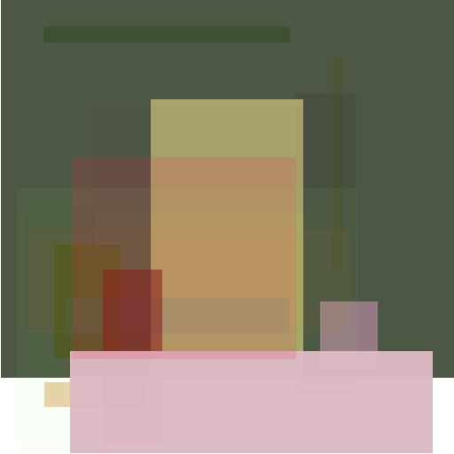

# How we're building this

## Round one

> "Build one to throw one away."

So we got the version 1.0 working, and after many many hours it can crank out something like this:

To be honest, it cranks out something like this in about an hour, and then it
stablizes to what seems to be the local maximum: a pink-ish square in front of a dark green square.

So it works, which is good, but we would like it to do better. There are various things we could tune, like:
- The scoring function between the reference image and the one under iteration.
- The various hyperparameters in the evolution like amount of kids and mutation rate. 
- The more generic config of the run like amount of boxes.

These are a fine target for hyperparameter tuning, but the problem is that this thing is really slow at the moment. A single step in the evolution takes more than a second, and it seems that we need hundreds of steps to evolve. So we need to make it faster. (At the same time, we'll probably want to make it a bit cleaner as well. This has been the "throw one away" -version.)